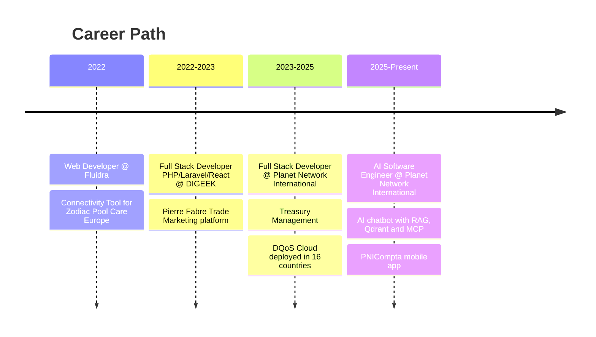
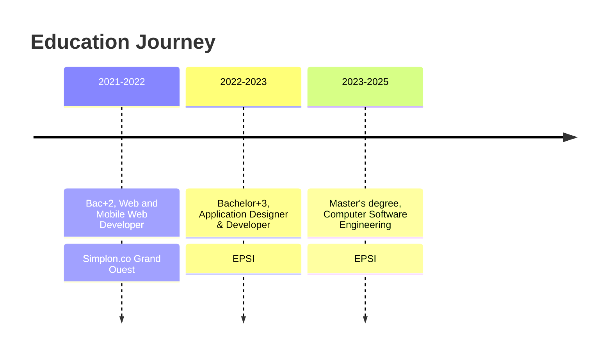

<div align="center">

# Enock M. MAYA

### AI & Software Engineer | Python/Django & React Developer

[](https://git.io/typing-svg)

[](https://www.linkedin.com/in/enockmukoko-maya)
[](https://github.com/Enockm21)
[](mailto:enock.mukokom@gmail.com)

</div>

---

## About Me

I'm a **Generative AI Engineer and Software Engineer** specialized in **Python**, designing intelligent applications built to solve real business problems, from architecture to production. My experience spans product development (**Django**, **FastAPI**, **React**) and modern AI architectures based on **agents**, **RAG**, and the **MCP** protocol. At Planet Network International, I contributed to an AI architecture now deployed in **16 countries** for telecom regulation and quality-of-service analysis.

```python
class AIEngineer:
    def __init__(self):
        self.name = "Enock M. MAYA"
        self.role = "AI & Software Engineer | Python/Django & React Developer"
        self.location = "Toulouse, Occitanie, France"
        self.email = "enock.mukokom@gmail.com"
        self.phone = "0752152357"
        self.core_expertise = [
            "Python",
            "Django / FastAPI",
            "React",
            "LangChain",
            "RAG",
            "MCP",
            "Docker / Kubernetes",
        ]

    def current_focus(self):
        return "Building AI-powered chatbots connected via RAG and MCP at PNI"

    def mindset(self):
        return "Understand the real need, challenge assumptions, ship fast and solid"
```

## Quick Stats

- Master's degree, Computer Software Engineering - EPSI (2023 - 2025)
- Bachelor +3, Application Designer & Developer - EPSI (2022 - 2023)
- Contributed to an AI architecture deployed in **16 countries** (telecom regulation & quality of service)
- Stack spanning generative AI (LangChain, RAG, MCP), full-stack (Django, FastAPI, React), and mobile (Flutter)
- Certifications: Introduction to Data Engineering, Découvrir React Native, Confirmé Maîtrise de la qualité en projet web

---

## Professional Experience

### Python & React Developer / AI Software Engineer | Planet Network International

**October 2025 - Present**

Building an AI chatbot connected to the **DQoS** & **RPM System** solutions.

- **RAG Architecture**: Designed a Retrieval-Augmented Generation architecture with semantic indexing and search via **Qdrant**
- **Multi-source connectivity**: Connected the chatbot to DQoS databases (via **MCP**) and RPM System's functional/technical documentation
- **AI Orchestration**: Orchestrated AI pipelines with **LangChain**, managing context via the **Model Context Protocol (MCP)**
- **Models & deployment**: Integrated open-source models via **Hugging Face**, running LLMs locally via **Ollama**
- **Observability**: Monitored chatbot quality, relevance, and drift with **Arize Phoenix**

**Stack**: Python, LangChain, RAG, Qdrant (Vector DB), MCP, Hugging Face, Ollama, Arize Phoenix

Also responsible for **PNICompta**, a cross-platform mobile treasury management app (**Flutter**, Android/iOS).

---

### Full Stack Developer | Planet Network International

**September 2023 - October 2025**

**Treasury Management** - owned end-to-end, from needs analysis to production deployment.

- **Banking integrations**: Direct integration with banking aggregators (Bridge, Tink) for financial data flows
- **Unified dashboard**: Centralized multiple bank accounts, real-time treasury visibility, multi-month financial forecasts
- **Automation**: Automatic aggregation/categorization of daily bank transactions and reconciliation with supplier invoices (OVH S3 bucket)

**Telecom regulation**: Maintained and evolved **DQoS Cloud**, a solution used by telecom regulatory authorities in **16 countries**, including a Python multi-process script for parsing and aggregating network data (XML to PSV).

**Stack**: Python, Django, PostgreSQL, REST API, OVH Cloud (S3), PHP, Laravel, React, MySQL, Microservices, Linux, Git

---

### Full Stack Developer PHP/Laravel React | DIGEEK

**September 2022 - October 2023**

- **Application maintenance**: Evolutive and corrective maintenance of the **Kanguroo** application
- **Pierre Fabre platform**: Built a trade marketing management platform for pharmaceutical brands (Avène, Klorane, Ducray, Oral Care) - **Laravel** REST API and **React** front end
- **Features**: Client/user management, roles & permissions, operations & challenges, PDF report generation

**Stack**: PHP, Laravel, React, JavaScript, REST API, MySQL, Git, Trello

---

### Web Developer | Fluidra

**May 2022 - August 2022**

Built the **Connectivity Tool (C-Tool)** at Zodiac Pool Care Europe, a cross-platform desktop application for managing and testing connected robots.

- **Desktop application**: Windows, Linux, macOS for managing robots in development and production
- **Hardware integration**: Close collaboration with an embedded systems engineer, firmware flashing and OTA updates
- **Connectivity**: Robot communication via Bluetooth, Wi-Fi, and LiFi; device registration and device shadow

**Stack**: Electron.js, JavaScript, HTML, CSS, Node.js, jQuery, Bootstrap, AWS SDK JS, Noble (Bluetooth), Node Serial Port, JIRA

---

## Tech Stack

### AI & Agentic Systems


### Vector & Knowledge Databases


### Backend & Microservices


### Full-Stack Development


---

## Professional Journey



---

## Education



---

## Languages

<div align="center">

| Language | Proficiency |
| --- | --- |
| French | Native |
| English | Professional |

</div>

---

## What Drives Me

- Designing robust AI architectures, from RAG to agents connected via MCP
- Turning complex business needs into simple, usable products
- Software quality and industrialization: CI/CD, automated testing, containerization
- Environments where you need to think fast and learn fast
- Shipping quickly without sacrificing robustness

---

## Let's Connect

<div align="center">

[](https://www.linkedin.com/in/enockmukoko-maya)
[](https://github.com/Enockm21)
[](mailto:enock.mukokom@gmail.com)

Toulouse, Occitanie, France | 0752152357

</div>

---

<div align="center">

### "Turning complex business needs into intelligent, usable systems"

</div>
